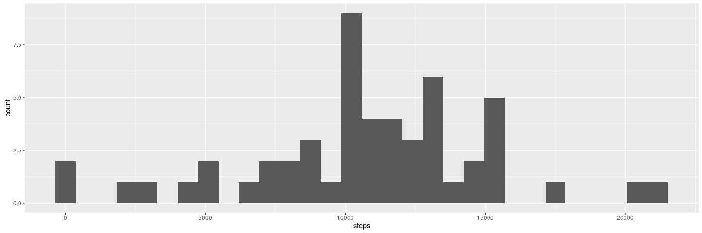
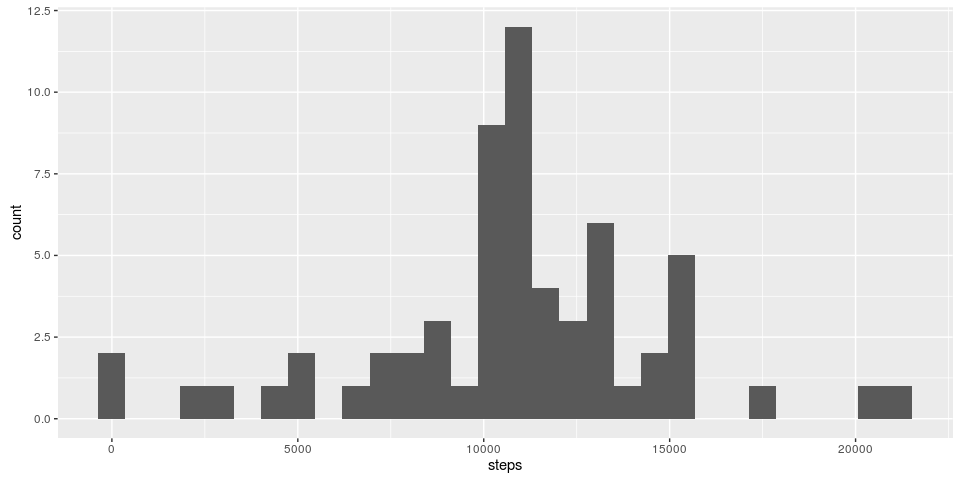
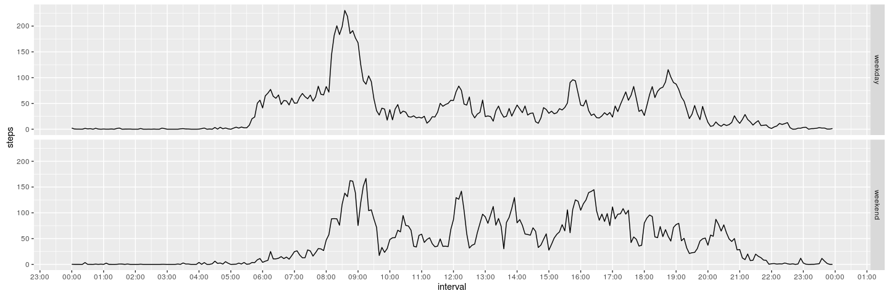

# Reproducible Research: Peer Assessment 1


## Loading and preprocessing the data

```r
setwd('~/Coursera/4 - Reproducible Research/Week 2/Project')
library(ggplot2)
library(scales)
library(signal)
```

```
## 
## Attaching package: 'signal'
```

```
## The following objects are masked from 'package:stats':
## 
##     filter, poly
```

```r
activity <- read.csv('activity.csv')
pp <-cbind(as.character(activity$date),sprintf("%04d",activity$interval))               
activity$interval <- (pp[,2]) # converting interval column from "5, 10, 15" representation to "0005,0010,0015" representation
activity$datetime <- as.POSIXct(paste(pp[,1],pp[,2],sep='-'), format = '%F-%H%M', tz = "IDT") #creating datetime column as POSIXct
tail(activity)
```

```
##       steps       date interval            datetime
## 17563    NA 2012-11-30     2330 2012-11-30 23:30:00
## 17564    NA 2012-11-30     2335 2012-11-30 23:35:00
## 17565    NA 2012-11-30     2340 2012-11-30 23:40:00
## 17566    NA 2012-11-30     2345 2012-11-30 23:45:00
## 17567    NA 2012-11-30     2350 2012-11-30 23:50:00
## 17568    NA 2012-11-30     2355 2012-11-30 23:55:00
```

## What is mean total number of steps taken per day?

```r
stepsEachDay <- aggregate(steps ~ date, data = activity, sum) #total number of steps taken per day
pl<- ggplot( mapping = aes(x= steps), data = stepsEachDay)  + 
     geom_histogram(bins = 30)
print(pl)
```

<!-- -->

```r
'Mean and median number of steps each day:'
```

```
## [1] "Mean and median number of steps each day:"
```

```r
summary(stepsEachDay$steps)  
```

```
##    Min. 1st Qu.  Median    Mean 3rd Qu.    Max. 
##      41    8841   10760   10770   13290   21190
```

## What is the average daily activity pattern?

```r
#calculate average number of steps every 5-minute interval 
avgStepsEachInterval <- aggregate(steps ~ interval, data = activity, FUN =  mean, simplify = TRUE )
#and convert interval to POSIXct so that plot will have time ticks labels on x axis
avgStepsEachInterval$interval <- as.POSIXct(avgStepsEachInterval$interval,format ='%H%M',tz = "IDT")

pl<- ggplot( mapping = aes(x= interval, y = steps, group = 1), data = avgStepsEachInterval)  + 
     geom_line() + scale_x_datetime(date_breaks = '1 hour', date_labels ='%H:%M')

print(pl)
```

<!-- -->

```r
#find at which time interval, steps is the biggest
maxSteps <- 
  avgStepsEachInterval$interval[avgStepsEachInterval$steps == max(avgStepsEachInterval$steps)]
show(paste('maximum number of steps is at: ', as.character.POSIXt(maxSteps, format = '%H:%M')))
```

```
## [1] "maximum number of steps is at:  08:35"
```


## Imputing missing values


```r
paste('Total rows wit NA values:', sum(is.na(activity$steps)))
```

```
## [1] "Total rows wit NA values: 2304"
```

```r
act.no.NAs <- activity 
#act.no.NAs$interval <- as.character(act.no.NAs$interval)
naInds <- which(is.na(act.no.NAs$steps)) #get IDs of all rows that have NA steps values
nas <- cbind(naInds, act.no.NAs[naInds,'interval'] ) #nas are naIDs and corresponding intervals 
colnames(nas)<- c('naIDs', 'interval')# colnames were lost in 2 previous lines, so I have to restore them
#Re-calculate avgStepsEachInterval from previous paragraph
avgStepsEachInterval <- aggregate(steps ~ interval, data = activity, FUN =  mean, simplify = TRUE )
#avgStepsEachInterval$interval <- as.character(avgStepsEachInterval$interval)
nas <- merge(x = nas, y = avgStepsEachInterval, by = 'interval', all.x = TRUE) # nas now holds average steps for every  point that is NA
nas$interval <- as.character(nas$interval) #must convert to char
nas$naIDs <- as.character(nas$naIDs) #must convert to char
act.no.NAs[nas$naIDs,'steps'] <- nas[,'steps']#replacing NA values in a copy of original dataset with average values

#Make a histogram of the total number of steps taken each day
stepsEachDay <- aggregate(steps ~ date, data = act.no.NAs, sum)
pl<- ggplot( mapping = aes(x= steps), data = stepsEachDay)  + 
     geom_histogram(bins = 30)
print(pl)
```

<!-- -->

```r
'Mean and median number of steps each day:'
```

```
## [1] "Mean and median number of steps each day:"
```

```r
summary(stepsEachDay$steps)  
```

```
##    Min. 1st Qu.  Median    Mean 3rd Qu.    Max. 
##      41    9819   10770   10770   12810   21190
```

```r
show(paste('The values have minor differences'))
```

```
## [1] "The values have minor differences"
```


## Are there differences in activity patterns between weekdays and weekends?

```r
library(chron)
#Sys.setlocale("LC_TIME","C")
act.no.NAs$weekday.name <- weekdays(act.no.NAs$datetime)#calculate name of day so that I can verify that is.weekend worked correct

#Create a new factor variable in the dataset with two levels – “weekday” and “weekend”
act.no.NAs$Weekday[is.weekend(act.no.NAs$date)] <- 'weekend' 
act.no.NAs$Weekday[!is.weekend(act.no.NAs$date)] <- 'weekday'
act.no.NAs$Weekday <- factor(act.no.NAs$Weekday)

avgStepsEachInterval <- aggregate(steps  ~ interval + Weekday, data = act.no.NAs, FUN =  mean, simplify = TRUE )
avgStepsEachInterval$interval <- as.POSIXct(avgStepsEachInterval$interval,format ='%H%M',tz = "IDT")
pl<- ggplot( mapping = aes(x= interval, y = steps, group = 1), data = avgStepsEachInterval) + 
     geom_line() + scale_x_datetime(date_breaks = '1 hour', date_labels ='%H:%M') +
     facet_grid(Weekday~.)
print(pl)
```

<!-- -->

