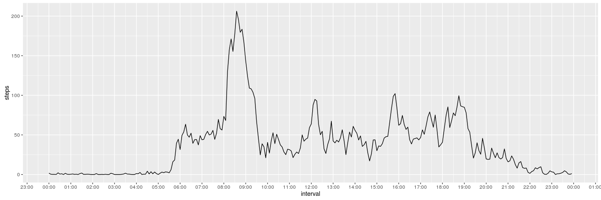

# Reproducible Research: Peer Assessment 1


## Loading and preprocessing the data

```
## 
## Attaching package: 'signal'
```

```
## The following objects are masked from 'package:stats':
## 
##     filter, poly
```

```
##       steps       date interval            datetime
## 17563    NA 2012-11-30     2330 2012-11-30 23:30:00
## 17564    NA 2012-11-30     2335 2012-11-30 23:35:00
## 17565    NA 2012-11-30     2340 2012-11-30 23:40:00
## 17566    NA 2012-11-30     2345 2012-11-30 23:45:00
## 17567    NA 2012-11-30     2350 2012-11-30 23:50:00
## 17568    NA 2012-11-30     2355 2012-11-30 23:55:00
```

## What is mean total number of steps taken per day?
<!-- -->

```
## [1] "Mean and median number of steps each day:"
```

```
##    Min. 1st Qu.  Median    Mean 3rd Qu.    Max. 
##      41    8841   10760   10770   13290   21190
```

## What is the average daily activity pattern?
<!-- -->

```
## [1] "maximum number of steps is at:  08:35"
```


## Imputing missing values


```
## [1] "Total rows wit NA values: 2304"
```

<!-- -->

```
## [1] "Mean and median number of steps each day:"
```

```
##    Min. 1st Qu.  Median    Mean 3rd Qu.    Max. 
##      41    9819   10770   10770   12810   21190
```

```
## [1] "The values have minor differences"
```


## Are there differences in activity patterns between weekdays and weekends?
<!-- -->

